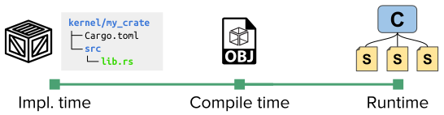
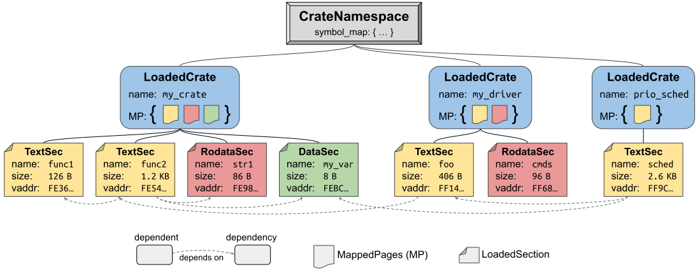
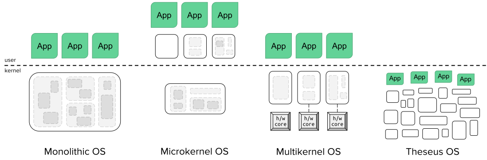

# Theseus 的设计与结构

Theseus 是一个安全语言操作系统（safe-language OS），其中所有代码都运行在单一地址空间（SAS）和单一特权级（SPL）之中。
这涵盖了从底层的内核组件到更高层的操作系统服务、驱动程序、库等等，直至用户应用程序的一切内容。
保护与隔离由编译器和语言本身所保证的类型安全与内存安全来提供，这将在[后续章节](https://www.theseus-os.com/Theseus/book/design/idea.html)中详细说明。

## 由许多小*细胞*构成的结构

Theseus 被实现为许多称为***细胞（cell）***的小实体的集合，细胞是一种由软件定义的模块化单元，是 Theseus 的核心构建块。
细胞这一概念是我们创造的术语，用来表示可被加载进 Theseus 的单个代码和/或数据实体。
细胞*不是*执行线程，也与 Rust 的 `std::cell` 类型无关。

### 生物细胞的类比

Theseus 中的细胞受到生物体内细胞的启发，并与后者十分相似，因为二者有许多共同属性：

- 细胞是基本的结构单元
- 细胞是更大整体中微小的组成部分，却在复杂的交互与层级关系中保持自身的独立性
- 每个细胞的角色千差万别，但都可以在同一个统一抽象之下被观察
- 细胞具有可辨识的边界（细胞膜 = 公共接口），明确调控什么可以进出（选择性通透 = 命名可见性）
- 细胞可以被任意地"重构"为多个不同的单元（减数分裂/有丝分裂 = 在线演化）
- 细胞在失效或死亡后可以被独立替换（细胞运动性 = 故障恢复）

因此，我们有时把 Theseus 称为***细胞内核（cytokernel）***，即由细胞构成的内核。这凸显了 Theseus 的设计与其他内核（例如单内核、微内核、多内核等）之间的区别。[在此阅读更多内容](https://www.theseus-os.com/Theseus/book/design/design.html#comparison-with-other-os-designs)。

### 细胞 ≈ crate

目前，*细胞*与 Rust 的 *crate* 之间是一一对应的关系。[crate](https://doc.rust-lang.org/book/ch07-01-packages-and-crates.html) 是 Rust 的项目容器，由源代码和一个[依赖清单](https://doc.rust-lang.org/cargo/reference/manifest.html)文件组成。crate 同时也是 Rust 的翻译单元（编译的基本单元）；在 Theseus 中，我们把每个 Rust crate 配置为编译成单个 `.o` 目标文件（可重定位的 ELF 文件）。

因此，*细胞*抽象在 Theseus 中始终存在，只是会呈现出如下面示意图所示的不同形态。

- 在实现时，细胞是一个 crate。
- 在编译（构建）之后，细胞是一个单独的 .o 目标文件。
- 在运行时，细胞 🄲 是一个结构体，其中包含来自其 crate 目标文件的节（section）集合 🅂 —— 这些节已被动态加载并链接进内存 —— 以及关于它与其他细胞之间相互依赖关系的元数据。

在 Theseus 中，为每个细胞存储的元数据由[the `kernel/crate_metadata` crate](https://theseus-os.github.io/Theseus/doc/crate_metadata/index.html) 定义，其中包含两个主要类型：

- LoadedCrate，表示已加载进内存并与其它已加载 crate 链接在一起的单个 crate。LoadedCrate 拥有存放其各节的内存区域，以及关于该 crate 中各节与符号的其他元数据。
- LoadedSection，表示已加载 crate 中的单个节，与目标文件中的定义相对应。一个 LoadedSection 包含以下几个主要部分：
    - 节类型，例如 .text（可执行的函数）、.rodata（常量数据）、.data/.bss（可读写数据）
    - 出向依赖：来自其他 crate、本节所依赖（链接）的其他节的列表。
    - 入向依赖：来自其他 crate、依赖（链接）本节的其他节的列表。
    - 指向其所属"父" crate 的引用，以及本节在该 crate 内存区域中被加载的位置。

请注意，依赖关系是按节这一细粒度进行追踪的，以便支持诸如运行时在线演化、系统灵活性、故障恢复等具有挑战性的操作系统目标。
这些依赖关系由 ELF 目标文件中 `.rela.*` 节所指定的重定位条目推导而来。这比从 crate 级别的 `Cargo.toml` 清单中推导依赖要精确得多。

每个细胞都被加载并链接进一个*命名空间*，我们称之为 `CellNamespace` 或 `CrateNamespace`，它表示由其中各细胞所暴露的全部公共可见符号构成的真正的命名空间。命名空间不仅有助于在动态链接期间快速完成依赖（符号）解析，还在上述系统目标中扮演关键角色，尤其是灵活性：借助命名空间，可以高效地实现多个彼此不同的*操作系统个性（OS personality）*，以满足需求各异的应用程序。

上图描绘了一组简单的三个 crate，它们的节相互依赖，因而被链接进同一个命名空间。`MappedPages`（MP）对象是 Theseus 对被拥有内存区域的抽象。TODO: link to memory.md

## 与其他操作系统设计的比较

下图展示了现有的操作系统/内核设计与 Theseus 在结构上的区别。

**单内核操作系统**最为常见，包括 Linux 及其他类 Unix 操作系统，以及 Windows 和 macOS 等大多数商业系统。
在单内核操作系统中，所有内核组件都存在于同一个内核地址空间中并在此运行，这意味着内核内部的通信快速而高效：只需使用函数调用和共享内存访问即可。
然而，单内核操作系统对内核内故障的抵抗力较弱，因为内核空间中的任何崩溃（例如一个有缺陷的驱动程序）都可能使整个系统宕机。
应用程序必须通过系统调用请求内核代为执行特权操作，这需要进行特权模式切换。

**微内核操作系统**相对少见，但仍广泛存在于某些以可靠性为关键的计算领域，例如嵌入式系统。
微内核把尽可能多的内核功能移到独立的用户空间"系统服务器"进程中，使内核本身保持得非常小。
这提高了抗故障能力，因为每个内核实体都在自己的地址空间中以用户态执行；如果其中一个崩溃，系统的其余部分可以通过重启该失败的系统进程而继续执行。
然而，微内核的效率较低：所有跨实体的功能都需要进程间通信（IPC），这会带来开销高昂的上下文切换和模式切换。

**多内核操作系统**通过在每个硬件核心上运行一个复制的小内核实例，为众核（manycore）硬件架构提供了高可扩展性。根据底层硬件的不同，系统服务进程也可能在各（部分）核心间冗余复制，以减少争用从而提升性能。它们通常借用单内核与微内核系统的标准操作系统接口和抽象，不过呈现标准的共享内存抽象可能会损害性能。

**Theseus 操作系统**与上述三种系统设计不同，它的结构不依赖于底层硬件的任何方面。一切内容——包括应用程序、系统服务和核心内核组件——都存在于单一地址空间和单一特权级（"内核空间"）中并在此运行。
Theseus 的结构完全由软件定义，并建立在细胞这一模块化概念之上。
因此，通信和共享内存访问都是高效的，因为隔离与保护由编译器来保证。
不过，所有代码都必须使用像 Rust 这样的安全语言来编写。
关于 Theseus 安全语言操作系统设计的更多信息，请参阅[这一节](https://www.theseus-os.com/Theseus/book/design/idea.html)。
