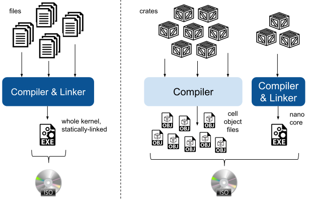

# 其他配置选项

TODO：介绍新的 `theseus_features` crate，以及它如何允许在 Theseus 构建中包含可选的 crate。

## Debug 模式与 Release 模式

Theseus 可以以多种模式构建，但提供了两种预设：**debug** 构建模式与 **release** 构建模式。
默认情况下，Theseus 以 release 模式构建，以便在 QEMU 等模拟器中获得可用的性能。
若要以 debug 模式构建，请在运行 `make` 时设置 `BUILD_MODE` 环境变量，如下所示：

```sh
make run  BUILD_MODE=debug  [host=yes]
```

与大多数语言一样，Rust 的 release 模式*快得多*，但用 GDB 调试起来会比较困难。

> 注意：以 debug 模式构建的 Theseus 运行起来*极其*缓慢；只有在需要调试棘手问题时才使用它。在 QEMU 中运行 Theseus 的 debug 构建时，你肯定需要启用 KVM，例如在 `make` 命令中使用上述 `host=yes` 参数。

有一个特殊的 Makefile [`cfg/Config.mk`](https://github.com/theseus-os/Theseus/blob/theseus_main/cfg/Config.mk)，其中包含构建模式选项以及内核 Makefile 中用到的其他配置选项。

## 构建期静态链接与运行时动态链接

Theseus 提供两种主要方式，把编译好的 crate 链接、打包进 ISO 镜像。
如下图所示，第一种（左侧）是传统的完全静态链接构建，所有其他操作系统都采用这种方式；
第二种（右侧）则是 Theseus 研究中所采用的一种新颖的动态链接方式。



### 标准构建期（静态）链接

默认情况下，Theseus 会像普通操作系统一样被构建成单个内核二进制文件，其中所有 `kernel` crate 都被链接为一个静态库，然后打包进可引导的 .iso 文件。
照常运行 `make` 时发生的就是这个过程。

### 运行时动态链接（可加载模式（loadable mode））

不过，Theseus 的研究版本对所有 crate（`nano_core` 除外）采用完全的动态加载与链接，以实现其诸多目标，如在线演化（live evolution）、通过容错保证可用性、灵活性等。
在运行时加载和链接 crate，正是 Theseus 实现*运行时持久边界*（runtime-persistent bounds）的机制；crate 管理子系统知道它把某个 crate 加载到了内存中的什么位置，因此可以维护每个已加载 crate 的元数据，从而跟踪其边界和依赖关系。

我们将其称为可加载模式（loadable mode），因为 crate 是在运行时被加载的（作为细胞（cell）），而不是被链接进单个静态内核二进制文件。

要启用这一模式，请设置 `THESEUS_CONFIG="loadable"` 选项（或直接运行 `make loadable`，它会替你完成设置）。这将导致以下事情发生：

- 照常把每个 crate 构建为各自独立的目标文件，但不会把它们全部链接到一起。
- 把每个 crate 的目标文件复制到顶层构建目录的 module 子目录（build/grub-isofiles/modules）中，使每个 crate 在最终的 .iso 镜像里都是一个独立的目标文件。
    - 引导加载程序会替我们把这些目标文件加载进内存，nano_core 在初始化 crate 管理子系统时会发现它们并将其映射到内存中。这使得 Theseus 能够在操作系统启动的一开始就看到并加载可用的 crate 目标文件，而无需完整的文件系统支持。
- 设置 loadable 配置选项，正如在 nano_core（以及其他 crate）中所见，这会启用 `#![cfg(loadable)]` 代码块，从而动态加载其他 crate，而不是把它们作为静态依赖包含进来。
    - 在 loadable 代码块中，调用者会动态查找被调用函数的符号并动态调用它，而不是通过常规函数调用直接调用。这会在源码中形成一种"软依赖"（soft dependency），而不是真正要求被调用 crate 与调用者 crate 静态链接的"硬依赖"（hard dependency）。
        - 这在概念上有点类似于 Linux 上用于[加载共享对象](https://man7.org/linux/man-pages/man3/dlsym.3.html)的 dlopen() 和 dlsym()。
    - 在代码库中搜索 cfg(loadable) 和 cfg(not(loadable))，可以看到它还在哪些地方被使用。

## Rust 内置的 cfg 与 target 选项

`#[cfg()]` 属性和 `cfg!()` 宏也可以与 Rust 编译器设置的内置 cfg 选项配合使用，例如与目标平台相关的值。

例如，Theseus 经常使用如下选项：

- #[cfg(target_arch = "x86_64")]
- #[cfg(target_feature = "sse2")]

这些特性的优点是，它们还可以用在 `Cargo.toml` 清单文件中来按条件设置依赖。例如：

```toml
## 仅当启用 "sse2" 时，才把 `core_simd` crate 作为依赖包含进来。
[target.'cfg(target_feature = "sse2")'.dependencies.core_simd]
...
```

遗憾的是，你不能在 `Cargo.toml` 文件中使用非内置的 cfg 选项来按条件指定依赖，例如任何来自 `THESEUS_CONFIG` 值的选项。

## 使用 cargo 的 `features`

另一种配置方式是暴露某个 crate 的 `features`；[关于 features 的更多内容请阅读此处](https://doc.rust-lang.org/cargo/reference/features.html)。

Theseus 并没有大量使用 features，因为它的结构是一个包含许多小 crate 的统一虚拟 workspace。在这种形式下，你无法轻松地通过一条命令行参数，同时为多个依赖它的 crate 设置某个目标 crate 的同一个 feature；相反，你必须逐一修改*每一个*依赖该目标 crate 的 crate 的 Cargo.toml 规范。

因此，我们使用 `cfg` 代码块而不是 `features`。

话虽如此，Theseus 在引入对第三方 crate 的依赖时，确实会选择自己想要使用的 features，但这只是极少数依赖才会出现的情形。通常，只有在需要选用某个 crate 的 `no_std` 版本时才会指定 features，也就是告诉该 crate 使用 Rust 的 `core` 库而非标准库。
